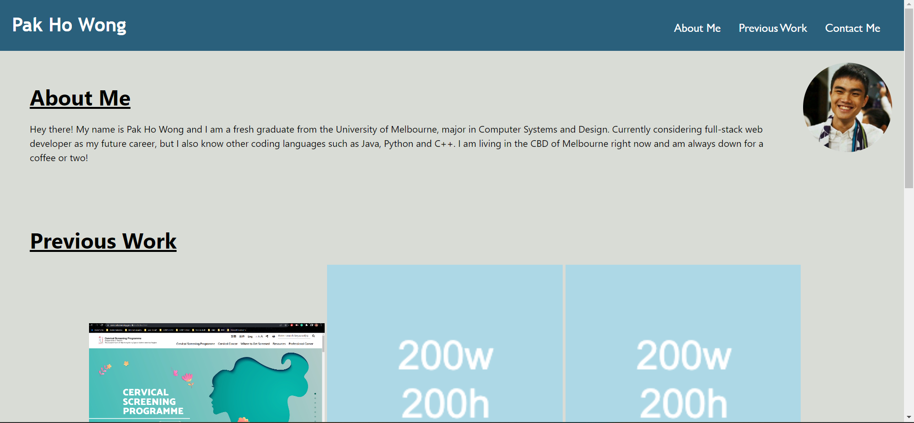

# Module 2 challenge Webpage

## Description

This Module 2 Challenge was created to complete the Module 2 Challenge of the bootcamp.

The project was built upon the template code retrieved from the solution code of the activity 28-Stu_Mini-Project (accessible in
https://monash.bootcampcontent.com/monash-coding-bootcamp/MONU-VIRT-FSF-PT-08-2022-U-LOLC/-/tree/main/02-Advanced-CSS/01-Activities/28-Stu_Mini-Project). Only the structure of the code has been utilized while the other parts of the project were built from scratch.

This project was made to build a personnel portfolio that will be updated throughout the entire bootcamp course. It contains a header,
three sections which includes About Me, Previous Work and Contact Me, and a footer. The About Me section is a brief introduction about
myself (with a recent picture of me); The Previous Work section showcases the projects I have previously worked on; The Contact Me section provides ways for people to contact me.

Pure HTML and CSS have been used to make this webpage.

## Installation

N/A

## Usage

Link to the deployed website: https://wongpakho814.github.io/Module-2-Challenge/

## Credits

N/A

## License

N/A
